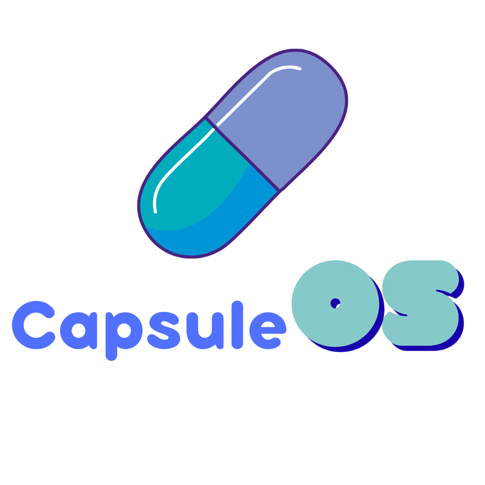

</img>

[](https://www.rust-lang.org/)
[](https://github.com/greenbugx/CapsuleOS/actions/workflows/check.yml)

> [!WARNING]
> Capsule OS is currently in active development. As we continue to implement new features, users may encounter bugs or performance issues. We appreciate your patience and invite you to stay tuned for future updates.

Capsule OS is a lightweight, self-contained operating system that runs entirely within a host operating system as a single executable. It provides a controlled runtime environment with its own filesystem, shell, and user interface, without requiring virtualization or direct hardware access.

## Overview

Capsule OS explores the concept of an operating system as an application. Instead of booting independently, it operates within an existing OS while maintaining internal abstractions typically associated with full systems.

The goal is to provide a portable, isolated environment that behaves like an OS while remaining simple to distribute and run.

## Key Features

* Single executable runtime with no installation requirements
* Internal filesystem abstraction with isolated user data
* Custom shell and command system
* Boot sequence with support for animated assets
* Theming and UI customization
* Fast startup and minimal overhead

## Architecture

Capsule OS is structured into modular components:

* **Core Runtime**: Handles initialization, lifecycle, and system coordination
* **Boot System**: Manages startup sequence and asset rendering
* **Filesystem Layer**: Provides a virtualized storage interface
* **Shell**: Command execution and user interaction
* **UI Layer**: Rendering, layout, and theming

The system operates entirely in user space and delegates hardware interaction to the host OS while maintaining logical isolation internally.

## Getting Started

### Build and Run

```bash
cargo run
```

### Release Build

```bash
cargo build --release
```

The compiled binary will be available in `target/release/`.

## Boot System

> [!IMPORTANT]
> This feature will not work in this current version.

Capsule OS supports customizable boot sequences through assets placed in the `boot/animated/` directory. Video-based animations are recommended for performance and visual consistency.

## Customization

Capsule OS is designed to be extensible and modifiable:

* Modify system behavior through `capsule.toml`
* Adjust UI and themes via `theme.rs`
* Extend shell functionality in `shell.rs`
* Customize filesystem logic in `fs.rs`

## Roadmap

```md
Phase 1 — The Core Shell            
Phase 2 — Theme Engine + Config         ← WE ARE HERE
Phase 3 — GUI Window Manager
Phase 4 — Hardware (audio/input)
Phase 5 — Built-in Apps
Phase 6 — Package Manager (capsule install)
Phase 7 — Browser
Phase 8 — Polish + Animated Boot loader
```

# Contributing

Contributions are always welcome. Keep implementations focused, avoid unnecessary abstractions, and ensure consistency with the existing architecture. Check [CONTRIBUTION.md](CONTRIBUTING.md) for more info.

# Philosophy

Capsule OS is an exploration of system design within constrained environments. It focuses on portability, control, and simplicity, redefining how an operating system can be delivered and experienced.

<p align=center><i>Lightweight on the outside, a system on the inside. A capsule, it is.</i></p>